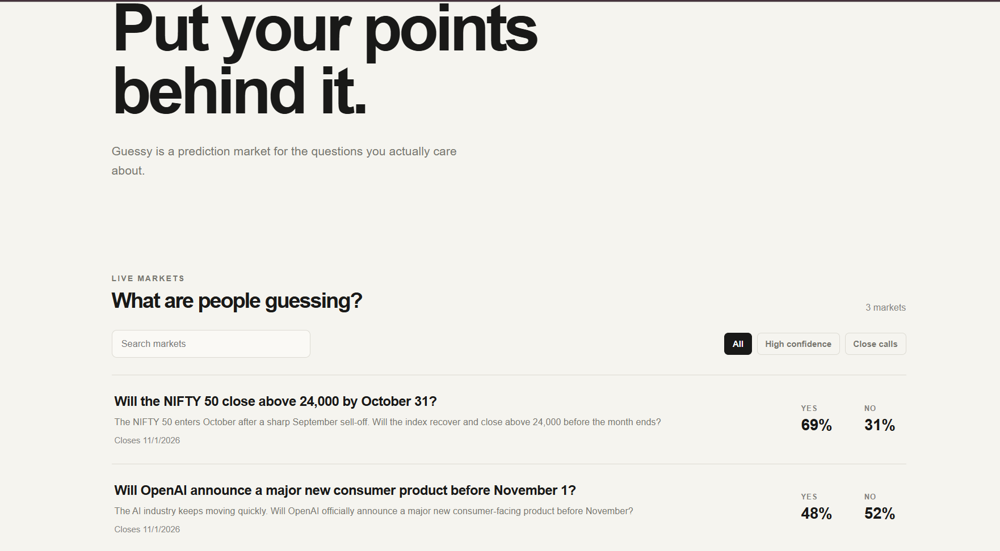

# Guessy.

A prediction market where users make guesses, trade virtual points, and watch probabilities change.

## Preview

## Live Demo

[guessy.](https://guessy-27ao.vercel.app)

## Features

- Create prediction markets
- Trade YES / NO positions
- Dynamic market pricing
- User authentication
- Portfolio & trade history
- Market resolution
- Trader leaderboard

## How It Works

Users can browse prediction markets and sign in to receive virtual points. These points can be used to take YES or NO positions on available markets. As users trade, the market probability changes based on trading activity. When a market is resolved, users who predicted the correct outcome receive their virtual payout.

## Tech Stack

Next.js · React · TypeScript · CSS · Node.js · Express · PostgreSQL · Prisma

## Status

Built and deployed.